# 3D Pong User Manual

3D Pong is a web-based multiplayer game that brings the classic game of Pong
into three dimensions. We intend to serve users that want to play a quick,
simple, casual or competitive game to pass the time or socialize with others.

## System requirements

3D Pong is designed for both mobile and desktop play, and supports most modern
browsers.

To increase performance, it is recommended to run 3D Pong with few (if any)
other tabs open in the browser instance. Furthermore, to reduce latency and
hitches, a stable network connection is recommended.

## Logging in

First, visit the [3D Pong website](https://pong.wongzhao.com) in a web browser.
Press the link on the screen to log in using your Google account.

## User profile

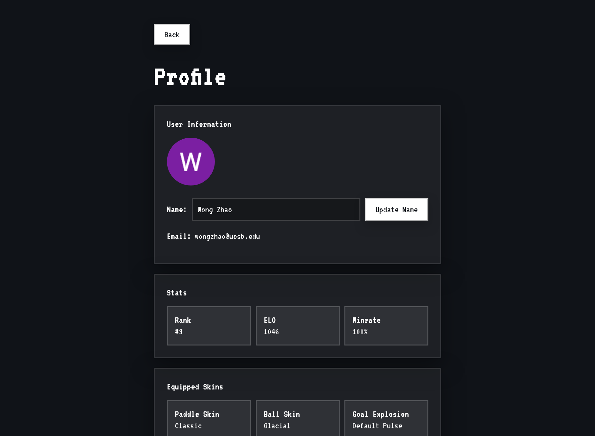

Once logged in, the login button will be replaced by a button to view and edit
your profile.

On this page, you can change your display name, which will be displayed to other
players ingame.

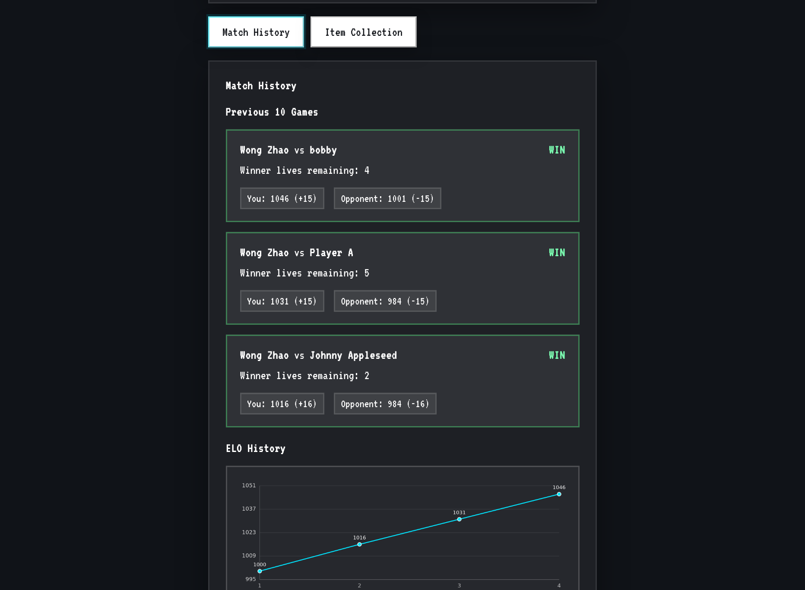

Your profile also contains your match/ELO history in the "Match History" tab,
and your cosmetics inventory and equipped items in the "Item Collection" tab.

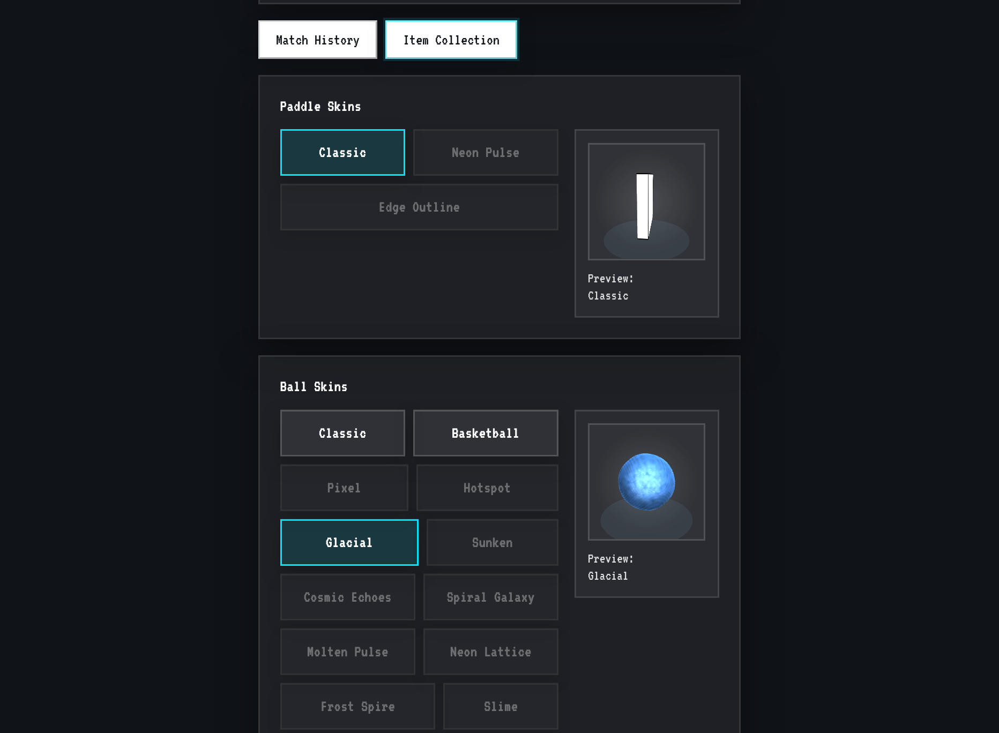

When your account is first created, you will only have the default cosmetics.
Once you unlock cosmetics (by winning a match), you can return to this page to
equip them.

Once ready to start a game, press "Back" to return to the main page.

## Starting a game

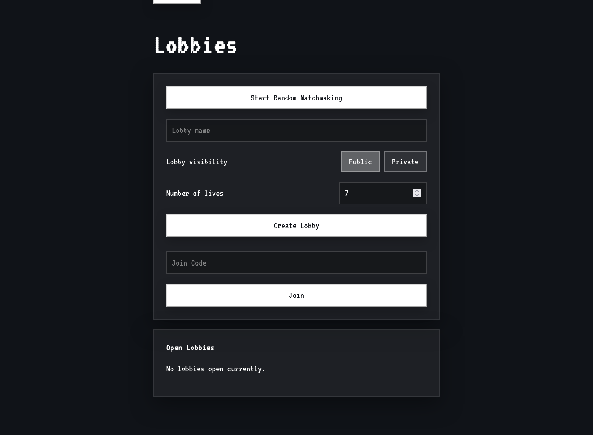

To start a game, you have multiple options.

If you press "Start Random Matchmaking," you will be placed in a random public
lobby currently accepting players, or create a new lobby if none are free. You
can use this button to start a game quickly.

You can also create a lobby manually, by (optionally) filling out a lobby name,
selecting whether the lobby should be public or private (i.e., whether it should
be publicly listed under "Open Lobbies" or require a code to join), and startng
number of lives. Press "Create Lobby" to create and join a lobby with the
current settings.

## Joining a game

To join a lobby, you can either press "Start Random Matchmaking" (described
under "Starting a game"), join using a 5-letter/number join code provided by the
lobby host, or join using the public lobby list under "Open Lobbies."

Only two players can be active in a game. If the lobby already contains two
players, you will join as a spectator.

## Waiting screen

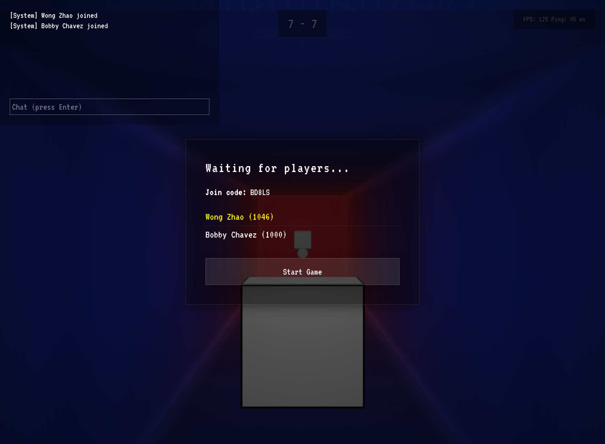

The waiting screen is shown prior to the game starting. The player who creates
the lobby is the host. The host has control over when the game starts, and if
they leave at the waiting screen, the lobby is destroyed.

Once two players are in the lobby, the host should press "Start Game" to start
the game.

## Chat

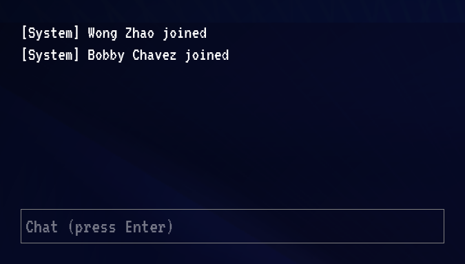

On the waiting screen or ingame, players can chat by typing in the chat box.
Press Enter to focus the chat box or to send a message while the chat box is
focused.

## Escape menu

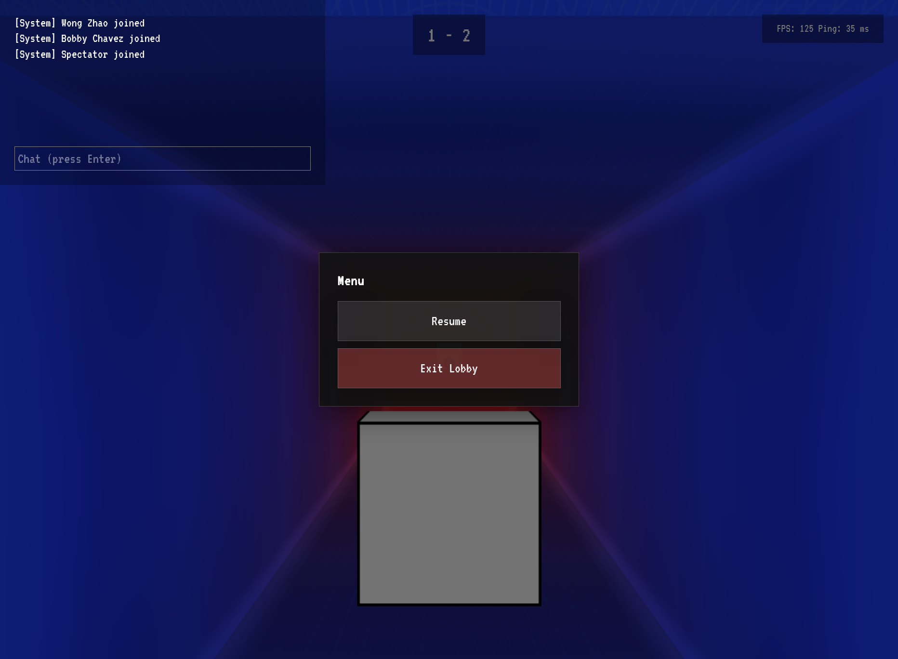

While in the game or waiting screen, press Escape to open a menu that allows you
to leave the lobby.

## Playing the game

Move the paddle using the WASD keys, arrow keys, or by using the joystick
(click/tap and drag anywhere on the screen). Your goal is to prevent the ball
from hitting your side by moving the paddle.

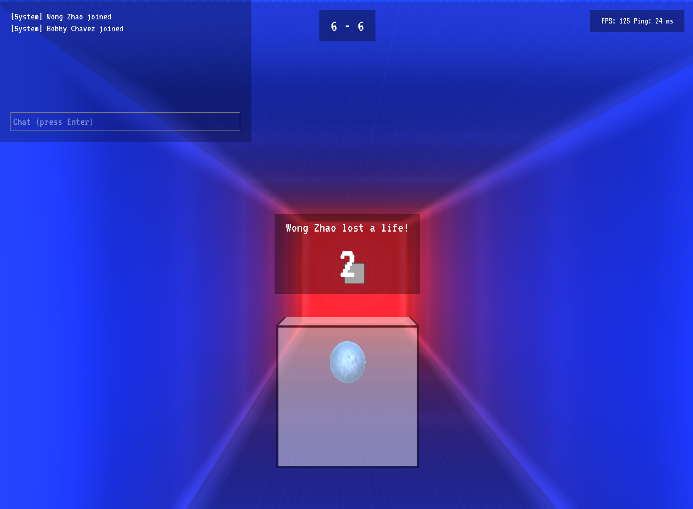

*This is the view of the player who is serving.*

Every time the ball is served, there is a 3-second countdown. During this time,
the player who is serving (the one whose paddle has the ball in front of it) can
move their paddle to determine the serve direction. The ball moves in the
direction that the paddle was moving when the countdown ends, with added forward
velocity.

Every time someone hits the ball, it will get faster. Paddle speed increases as
ball speed increases. Once the ball hits someone's side, its speed resets, and
that person loses a life and gets to serve.

Your and your opponent's lives are shown at the top (you on the left, opponent
on the right). The last player alive wins.

If a player disconnects during battle, that player loses automatically.

Your paddle skin applies to your paddle. The ball uses the skin of the player
who last served. The goal explosion of the opponent plays whenever someone loses
a life.

## Spectating the game

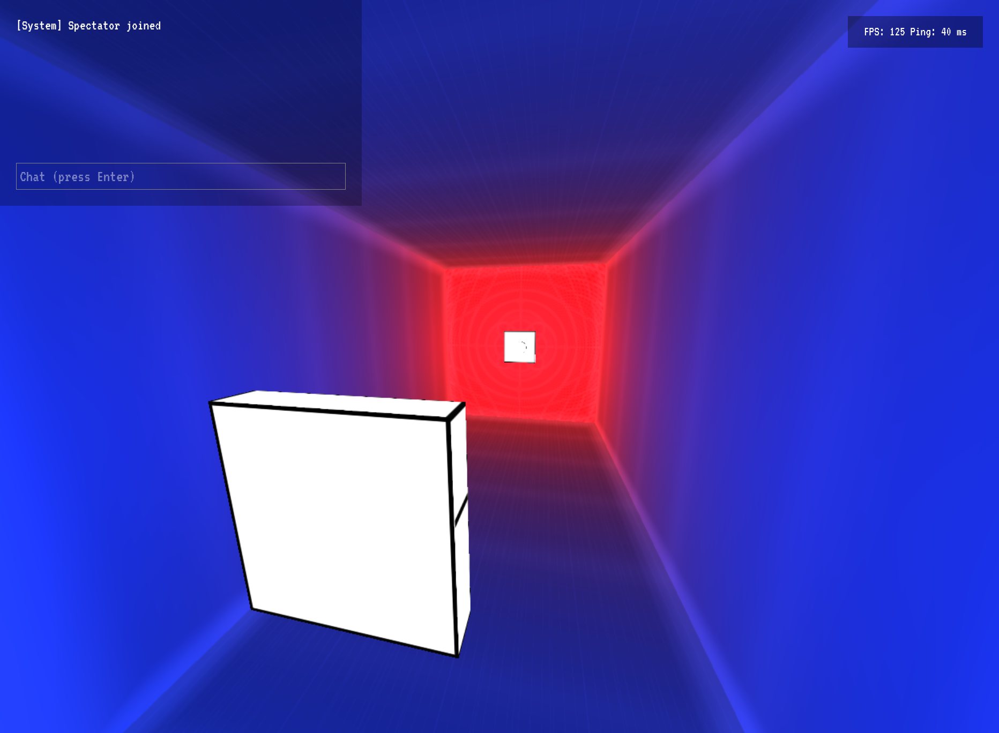

The spectator takes the perspective of one of the players. Press A/D or
Left/Right to change the view between the players. Click and drag to adjust the
camera angle.

## Game over

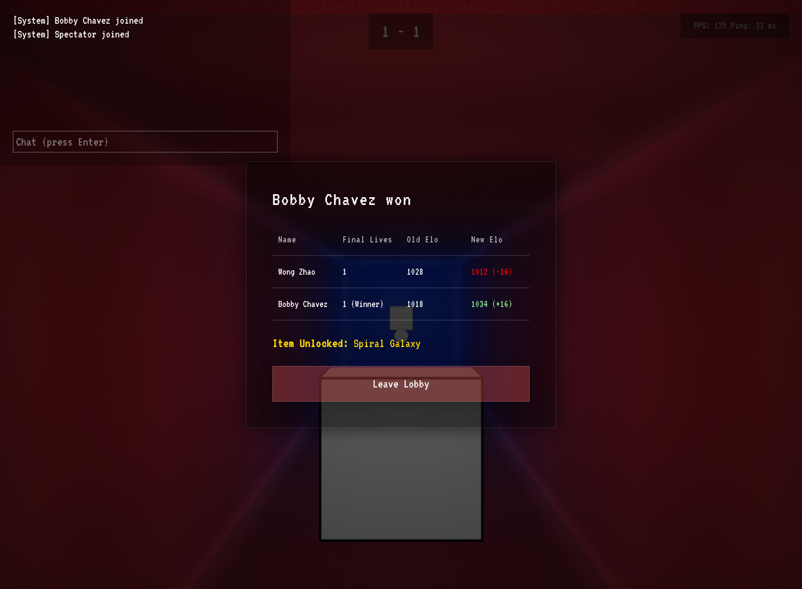

When the game ends, the game over screen displays. This screen shows which
player won, the ending lives, the change in ELO of each player, and the random
item that was unlocked for the winning player.

## Leaderboard

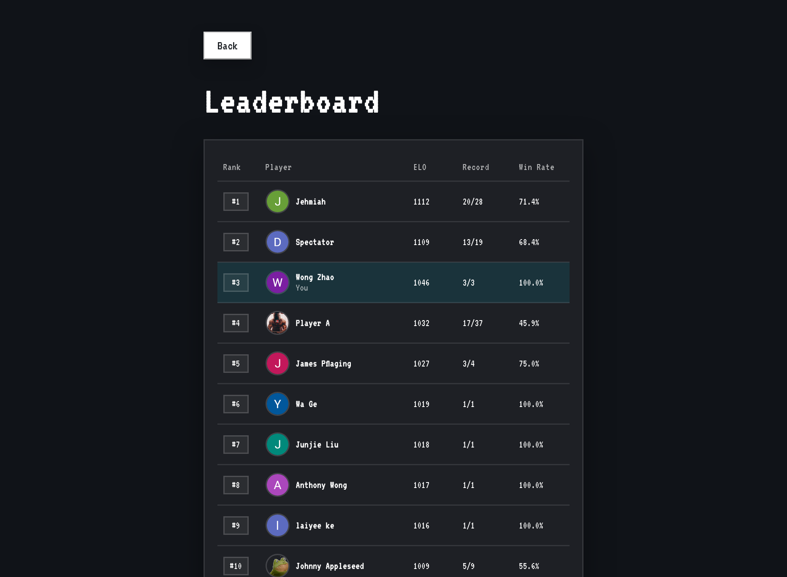

You can view the leaderboard by clicking the "Leaderboard" button on the main
page. Players are ranked based on their ELO score. Compare your rank with your
friends here!
